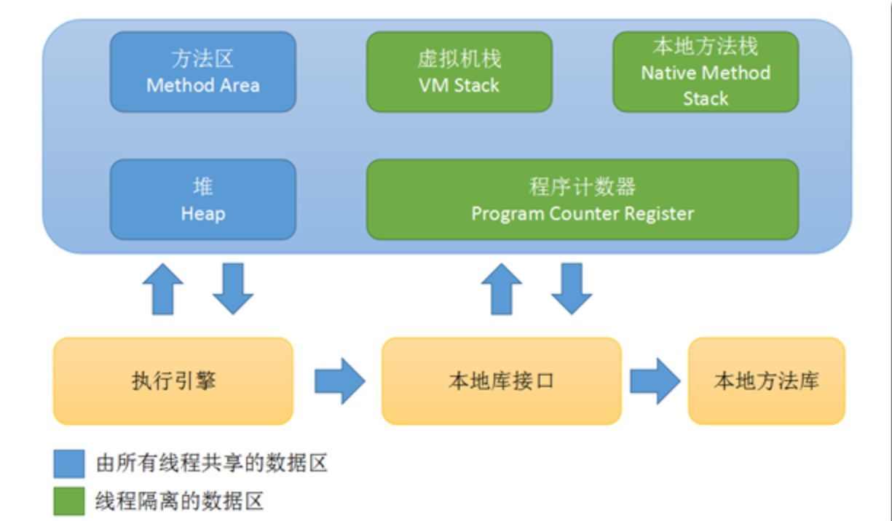

##  Java运行时数据区域简介

> Java虚拟机在执行Java程序的时候会将它管理的内存区域分为若干个不同的数据区域.这些区域都有自己的用途,创建和销毁时间.

可以看到运行时数据区域主要分为5个部分:方法区,堆,虚拟机栈,本地方法区,程序计数器. 其中前两个 方法区和堆是所有线程共享的.而后面三个是线程独享的.

### 1.程序计数器(*Program Counter Register,PC*)

相信学过计算机组成原理的同学对PC应该是不陌生,和硬件层次的PC类似**,JVM中的PC也是用来控制当前线程的执行流程**.那么为什么每一个线程都需要有一个PC呢?因为Java天生就是多线程程序,而多线程程序在单个处理核心上的执行不是按照顺序来的而是并发执行,也就是CPU是多个线程轮流使用的.如果一个线程执行到中途,CPU就进行了线程切换,那么它就要将自己执行到哪里记录下来,方便CPU下次来执行它的时候能够恢复到正常状态.

### 2.虚拟机栈(*Virtual Machine Stack VM Stack*)

VM Stack的生命周期和线程是相同的.**VM Stack述Java方法执行的内存模型**.我们常说的方法进栈,进的就是这个栈.
在每个方法被执行的时候,JVM都会同步的创建一个**栈帧**用来存储局部变量表,操作数栈,动态连接,方法出口等信息.每一个方法被执行就会有一个栈帧进VM Stack,执行完成之后就会出栈.

其中的局部变量表存放了各种JVM的基本数据类型(boolean,byte,char,short,int,long,float,double),对象引用(reference)和returnAddress类型.这些数据结在局部变量表中的存储空间是以**局部变量槽(*Slot*)**来表示的.其中除了double和long会占用两个Slot,其他都是只占用一个.

### 3.本地方法区(Native Method Area)

本地方法栈的作用与VM Stack十分相似,局别在于执行的方法不同,VM Stack执行java方法,本地方法栈执行Native(本地)方法.

### 4.Java堆(Java Heap)

j**ava中堆可以说是最大的内存区域,其中存储的是所有对象的实例和数组**.这里的内存空间是由垃圾收集器GC(Garbage Collector)负责的,因为java中内存不需要程序员手动管理,所以GC就会负责Java堆中的内存回收.其中堆中会给每个线程划分私有的分配缓冲区,来提高对象分配时的效率.

### 5.方法区(Method Area)

方法区也是所有线程共享的,方法区中主要存放的是已经被虚拟机加载的类型信息,常量,静态变量等数据.按照我个人的理解,方法区从一个程序开始编译就已经确定了并且长久不会改变.常量池也是方法区的一部分.