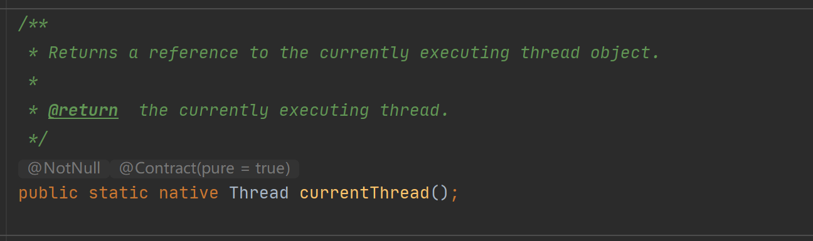

## Java中线程实现与线程模型

### 1线程的实现

> 大家都知道线程是OS进行系统调度的最小单位.在JAVA系统中线程同样也是资源调度的最小单位.每个OS都提供了线程的实现.JAVA为了实现程序的跨系统,提供了在不同硬件和OS中线程操作的统一.不过就算是操作上的统一,线程归根结底还是由OS来实现的.如果查看Thread类的源码实现,可以看到其中不少方法都是native.一个Native方法就意味着它是调用当前OS的底层方法来实现的.

eg: Thread 类的源码(可以看到这个方法根本没有方法体,原因是它其实就是调用OS底层的方法)

### 2.1线程的实现模型一(一对一模型 内核线程的实现)

> 一对一模型其实按照名字就可以知道,每一个创建的线程都对应着一个内核线程.**内核线程(Kernel Level Thread KLT)**,内核线程是直接由内核来完成其各种工作的.但是程序一般不会直接使用内核线程,而是使用它的一个高级接口---**轻量级进程(Light Weight Process LWP)**.而每一个LWP都有一个单独对应的KLT,所以这种线程关系模型被称为 1:1线程模型.但是显而易见,这样一对一的模式,系统的花费是比较大的.

### 2.2 线程的实现模型二(1:N模型 用户线程实现 )

> 一对多模型则是多个创建的线程对应着一个KLT.使用**用户线程(User Thread UT)**实现的方式叫做1:N模型.
> 广义上来说,一个线程只要不是KLT,那么它就是UT.
> 狭义上来说,一个UT是指完全建立在用户空间的线程库上的.UT的各种操作都在用户态中完成.

### 2.3线程实现模型三(M:N模型 混合实现)

- 公平锁:公平锁是指多个线程在等待同一个锁的时候,**必须**按照申请的顺序来获得锁,既**公平**
- 非公平锁:与公平锁相反,在锁被释放的时候,每一个在申请的线程都有机会获得当前锁
- 自旋锁:如果一个锁使用的是互斥同步(比如 synchronized Lock等),那么如果线程去申请一个锁,而这个锁已经被其他线程占有,那么正在申请的线程就会进入阻塞等待状态.而将它从阻塞等待状态唤醒需要大量的开销,所以这可以称得上是重量级的.而自旋锁就是为了解决这个问题而出现的.有了自旋锁之后,在出现同样的状况的时候,正在申请的线程不会立马进入阻塞等待状态,而是继续占有CPU的使用权,只是它什么都不做,执行一个忙循环(自旋,原地转圈圈,好像在做事其实只是原地踏步).直到锁被释放.  可以预见到如果这个锁被占用的时间很短,那么效果就会很好.但是如果这个锁被占用了很久才释放,那么就会得不偿失.因为这样线程就浪费CPU大量的执行时间.因此自旋等待的时间是有一定的限度的.自旋次数的默认值是10次.                                                                                                                                                                                                                                                                                                                                                                                                                                                
- 锁消除:锁消除是指虚拟机即使编译器在运行时,对一些代码要求同步,但是虚拟机又检测到不可能存在共享数据竞争的锁进行消除.简单来说,就是代码中要求同步,但是虚拟机发现没有必要进行同步(同步会影响性能),于是把没有必要的锁消除掉.

